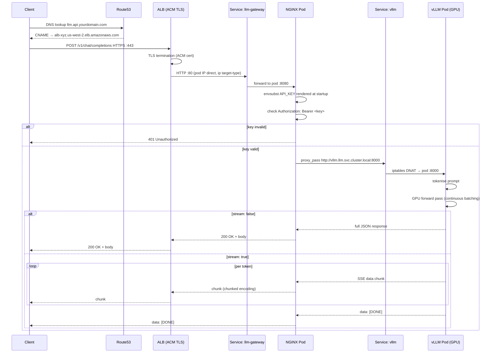

# Data Plane — Request Invocation

The data plane is the live request path: everything that happens between a client sending `POST /v1/chat/completions` and receiving a completion response. This document traces every hop, explains each component's role, and calls out the design decisions that affect latency, correctness, and reliability.

---

## Overview

```
Client
  │  HTTPS :443
  ▼
Route53 CNAME → ALB (TLS termination, ACM cert)
  │  HTTP :80
  ▼
Kubernetes Service: llm-gateway  (ClusterIP, port 80 → 8080)
  │  HTTP :8080
  ▼
NGINX Gateway Pod  (auth check, reverse proxy)
  │  HTTP :8000
  ▼
Kubernetes Service: vllm  (ClusterIP, port 8000 → 8000)
  │  HTTP :8000
  ▼
vLLM Pod  (inference on GPU)
  │  JSON / SSE response
  ▼
Client
```

---

## Hop 1 — DNS and TLS (Route53 + ALB + ACM)

### DNS

Route53 holds a CNAME record pointing `llm.api.yourdomain.com` to the ALB's auto-assigned DNS name. The ALB DNS name is stable across EC2 instance churn — it never changes unless you recreate the ALB itself.

### ALB provisioning

The ALB is not created manually. The AWS Load Balancer Controller watches Kubernetes `Ingress` objects and provisions a real ALB from the annotations in `ingress.yaml`:

```yaml
annotations:
  alb.ingress.kubernetes.io/scheme: internet-facing          # public IP
  alb.ingress.kubernetes.io/target-type: ip                  # route to pod IPs directly
  alb.ingress.kubernetes.io/listen-ports: '[{"HTTPS":443}]'  # HTTPS only — no HTTP
  alb.ingress.kubernetes.io/certificate-arn: <ACM_ARN>       # TLS certificate
  alb.ingress.kubernetes.io/healthcheck-path: /healthz        # ALB health target
  alb.ingress.kubernetes.io/load-balancer-attributes: idle_timeout.timeout_seconds=300
```

### `target-type: ip` vs `target-type: instance`

This is a significant choice. With `target-type: ip`, the ALB registers **pod IP addresses** directly in its target group. Traffic flows:

```
ALB → pod IP (via VPC routing)
```

With the default `target-type: instance`, the ALB routes to a NodePort on the EC2 instance, where kube-proxy then performs a second hop to the final pod:

```
ALB → EC2 NodePort → kube-proxy iptables → pod IP
```

`ip` mode removes one network hop, avoids the kube-proxy DNAT, and allows the ALB to see the real pod health state directly. It requires the VPC CNI plugin (`vpc-cni` add-on, installed by Terraform) so pods have routable VPC IPs.

### TLS termination

The ACM certificate is attached to the ALB listener. TLS is terminated at the ALB — everything from the ALB inward travels over plain HTTP. The ALB injects `X-Forwarded-Proto: https` so downstream components know the original scheme.

### Idle timeout

```
idle_timeout.timeout_seconds=300
```

LLM inference can take tens of seconds for long outputs. The ALB will drop a connection that is idle (no bytes transferred) for longer than the timeout. This value must be **at least as large as** the longest expected `proxy_read_timeout` downstream (also 300 s). If the ALB timeout is shorter, it silently closes the TCP connection mid-response and the client receives a truncated or empty reply.

### ALB health checks

The ALB polls `/healthz` on each gateway pod every 30 seconds (default). A pod is removed from the target group after 3 consecutive failures. This is separate from the Kubernetes readiness probe — the ALB and Kubernetes each run their own health loop.

---

## Hop 2 — Kubernetes Service: `llm-gateway`

```yaml
# gateway/service.yaml
spec:
  selector:
    app: llm-gateway
  ports:
    - port: 80          # ALB registers this port in the target group
      targetPort: 8080  # actual container port
```

The Service is type `ClusterIP` (default). In `ip` target mode, the ALB bypasses the ClusterIP and connects directly to the pod IP on `targetPort 8080`. The `port: 80` entry tells the ALB what port to probe on the pod. kube-proxy is not in the path for this hop.

If the gateway HPA has scaled to multiple replicas, the ALB has all of them in its target group and round-robins across them.

---

## Hop 3 — NGINX Gateway Pod (auth + proxy)

This is the only component in the data plane that makes a security decision. It does two things: validates the API key, then proxies to vLLM.

### How the nginx config is built at startup

The config is not baked into the image. Instead, a `ConfigMap` holds a template with a shell variable placeholder:

```nginx
# nginx-conf-template.yaml (simplified)
if ($http_authorization != "Bearer ${API_KEY}") {
  return 401;
}
proxy_pass http://vllm.llm.svc.cluster.local:8000;
```

At container startup, the entrypoint runs `envsubst '$API_KEY'` against the template and writes the rendered config to `/etc/nginx/conf.d/default.conf` before nginx starts:

```yaml
command: ["/bin/sh", "-c"]
args:
  - envsubst '$API_KEY' < /etc/nginx/templates/default.conf.template \
      > /etc/nginx/conf.d/default.conf && nginx -g 'daemon off;'
```

`API_KEY` is injected into the container environment from the `llm-api-key` Secret, which is KMS-encrypted at rest. The rendered config is never written to disk outside the container — it exists only in the running container's filesystem.

### Auth check

```nginx
location /v1/ {
  if ($http_authorization != "Bearer ${API_KEY}") {
    return 401;
  }
  ...
}
```

nginx compares the exact value of the `Authorization` header to the string `Bearer <API_KEY>`. Any request that does not match returns `401 Unauthorized` immediately — it never reaches vLLM. There is no token expiry, no rate limiting, and no user-level scoping in this baseline; a single shared key protects the endpoint.

The `/healthz` location is a separate block that always returns `200` and logs nothing:

```nginx
location = /healthz {
  access_log off;
  return 200 "ok";
}
```

ALB health checks hit `/healthz`, so they never touch the auth logic.

### Proxy headers

```nginx
proxy_http_version 1.1;
proxy_set_header Host              $host;
proxy_set_header X-Real-IP         $remote_addr;
proxy_set_header X-Forwarded-For   $proxy_add_x_forwarded_for;
proxy_set_header X-Forwarded-Proto $scheme;
```

`proxy_http_version 1.1` is required for streaming responses (chunked transfer encoding). HTTP/1.0 does not support chunked encoding, so streaming would break silently without it.

`X-Real-IP` and `X-Forwarded-For` pass the original client IP to vLLM's access logs for traceability. Because the ALB already sets `X-Forwarded-For`, nginx appends the ALB's IP to that header — forming a chain: `original-client-ip, alb-ip`.

### Proxy timeouts

```nginx
proxy_connect_timeout 10s;   # time to establish TCP connection to vLLM
proxy_read_timeout    300s;  # time to wait for vLLM to send the next byte
proxy_send_timeout    300s;  # time to wait for the client to accept a byte
```

`proxy_read_timeout` is reset on every byte received from the upstream — it is not the total response time. For streaming responses, each token vLLM emits resets this clock. The 300 s value supports very long outputs without nginx cutting the connection.

`proxy_connect_timeout 10s` is intentionally short. If vLLM's pod IP is unreachable within 10 s, the request fails fast with a `502`. This is preferable to a client waiting silently while a pod is stuck.

### Upstream DNS resolution

```nginx
proxy_pass http://vllm.llm.svc.cluster.local:8000;
```

nginx resolves `vllm.llm.svc.cluster.local` via CoreDNS when the worker process starts (and on each upstream connection for some configurations). CoreDNS returns the ClusterIP of the `vllm` Service. kube-proxy then handles the ClusterIP → pod IP translation via iptables rules on the node.

---

## Hop 4 — Kubernetes Service: `vllm`

```yaml
# vllm/service.yaml
spec:
  selector:
    app: vllm
  ports:
    - port: 8000
      targetPort: 8000
```

This is a ClusterIP Service. kube-proxy programs iptables rules on every node to intercept connections to the ClusterIP and DNAT them to one of the healthy pod IPs chosen by random selection. If the vLLM Deployment has two replicas, requests are split roughly 50/50 across them.

Only pods that have passed their readiness probe (`GET /health → 200`) are added to the Endpoints list. A pod still loading the model is not in the Endpoints list — kube-proxy will never route to it.

---

## Hop 5 — vLLM Pod (inference)

vLLM receives a standard OpenAI-format JSON body:

```json
{
  "model": "meta-llama/Llama-3.1-8B-Instruct",
  "messages": [
    { "role": "user", "content": "Hello" }
  ]
}
```

Internally, vLLM:

1. Tokenises the prompt using the model's tokenizer.
2. Checks the continuous batching queue — if other requests are in flight, this request joins the batch.
3. Runs a forward pass on the GPU for each new token until a stop condition (EOS token, `max_tokens` limit, or stop sequence).
4. Streams tokens back as they are generated (if `"stream": true`), or returns the full completion once generation is complete.

The GPU processes tokens in batches across concurrent requests. A single g5.2xlarge (A10G, 24 GB VRAM) can hold Llama-3.1-8B in ~16 GB and use the remaining ~6–8 GB for the KV cache, handling several concurrent requests before queueing begins.

---

## Port map

```
Client       :443  →  ALB (TLS termination)
ALB          :80   →  Service llm-gateway (pod IP, via VPC routing)
NGINX pod    :8080 →  listens here, proxies upstream
Service vllm :8000 →  ClusterIP → kube-proxy → pod
vLLM pod     :8000 →  listens here, serves inference
```

---

## Timeout chain

Every component in the path has a timeout. They must be aligned — a short timeout upstream silently aborts a long inference before the component downstream has had a chance to respond.

```
ALB idle timeout:       300 s   ← must be ≥ proxy_read_timeout
nginx proxy_read:       300 s   ← must be ≥ longest expected generation time
nginx proxy_connect:     10 s   ← fast-fail if vLLM pod is unreachable
nginx proxy_send:       300 s   ← must be ≥ longest client download time
vLLM (no hard limit)    —       ← governed by max_model_len and generation speed
```

If you need longer completions, increase `proxy_read_timeout` and `idle_timeout` together. If you decrease them to save cost, set `max_tokens` in client requests to ensure generation finishes within the window.

---

## Request and response format

This endpoint is OpenAI-API compatible. Clients that work with `gpt-4o` work here with only the `model` field changed.

### Non-streaming request

```bash
curl https://llm.api.yourdomain.com/v1/chat/completions \
  -H "Authorization: Bearer <API_KEY>" \
  -H "Content-Type: application/json" \
  -d '{
    "model": "meta-llama/Llama-3.1-8B-Instruct",
    "messages": [{"role": "user", "content": "Hello"}]
  }'
```

Response:

```json
{
  "id": "chatcmpl-...",
  "object": "chat.completion",
  "model": "meta-llama/Llama-3.1-8B-Instruct",
  "choices": [{
    "index": 0,
    "message": { "role": "assistant", "content": "Hello! How can I help you today?" },
    "finish_reason": "stop"
  }],
  "usage": {
    "prompt_tokens": 9,
    "completion_tokens": 10,
    "total_tokens": 19
  }
}
```

### Streaming request (SSE)

Adding `"stream": true` switches the response to Server-Sent Events. vLLM emits one `data:` line per token as it is generated. nginx streams them through to the client without buffering, because `proxy_http_version 1.1` enables chunked transfer encoding.

```bash
curl https://llm.api.yourdomain.com/v1/chat/completions \
  -H "Authorization: Bearer <API_KEY>" \
  -H "Content-Type: application/json" \
  -d '{
    "model": "meta-llama/Llama-3.1-8B-Instruct",
    "messages": [{"role": "user", "content": "Tell me a story"}],
    "stream": true
  }'
```

Each SSE chunk:

```
data: {"id":"chatcmpl-...","object":"chat.completion.chunk","choices":[{"delta":{"content":"Once"},"index":0}]}

data: {"id":"chatcmpl-...","object":"chat.completion.chunk","choices":[{"delta":{"content":" upon"},"index":0}]}

data: [DONE]
```

---

## Error responses by layer

| HTTP status | Raised by | Meaning |
|---|---|---|
| `401 Unauthorized` | NGINX | `Authorization` header missing or wrong key |
| `502 Bad Gateway` | NGINX | Could not connect to vLLM within `proxy_connect_timeout` |
| `504 Gateway Timeout` | NGINX | vLLM did not send a byte within `proxy_read_timeout` |
| `503 Service Unavailable` | ALB | No healthy gateway pods in target group |
| `404 Not Found` | vLLM | Path not in the OpenAI API (e.g. `/v1/unknown`) |
| `422 Unprocessable Entity` | vLLM | Invalid request body (wrong field types, missing `messages`) |
| `200 OK` | vLLM | Successful completion (non-streaming) |
| `200 OK` + SSE stream | vLLM | Successful streaming response |

---

## Full invocation diagram



---

## Smoke test

```bash
scripts/smoke_test.sh llm.api.yourdomain.com <API_KEY>
```

This sends a single non-streaming `POST /v1/chat/completions` with the message `"Hello"` and prints the raw JSON response. A successful response confirms every hop — DNS, TLS, ALB, auth, proxy, and inference — is working end to end.
