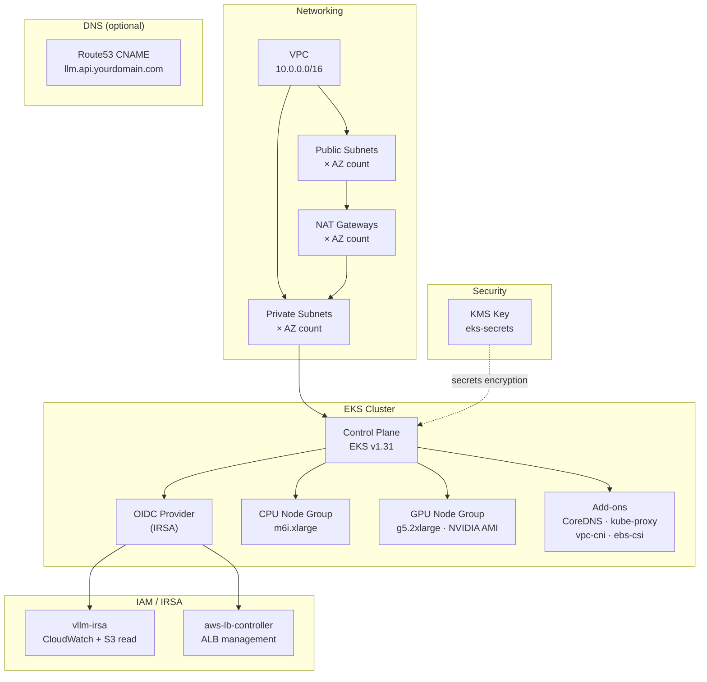

# Terraform — Networking and EKS Provisioning

This directory provisions the complete AWS foundation for the LLM inference platform: VPC, EKS cluster, node groups, IAM/IRSA roles, KMS encryption, and optional DNS.

---

## What Terraform provisions here

### 1. VPC and networking (`module.vpc`)

| Resource | Detail |
|---|---|
| VPC | `10.0.0.0/16` (configurable), spread across 2-3 AZs |
| Private subnets | One per AZ — EKS nodes live here |
| Public subnets | One per AZ — ALB lives here |
| NAT Gateways | One per AZ (non-single) — private nodes reach the internet |
| Subnet tags | `kubernetes.io/role/elb` and `karpenter.sh/discovery` applied automatically |

Private subnets are where all compute runs. Public subnets only hold the load balancer. Nodes never have public IPs.

### 2. EKS cluster (`module.eks`)

| Resource | Detail |
|---|---|
| Control plane | EKS v1.31, placed in private subnets |
| API endpoint | Private-only by default; optionally public with CIDR allowlist |
| Secret encryption | KMS key (`aws_kms_key.eks_secrets`) encrypts all Kubernetes secrets at rest |
| IRSA | OIDC provider enabled so pods can assume IAM roles without static credentials |
| Cluster add-ons | CoreDNS, kube-proxy, vpc-cni, aws-ebs-csi-driver (all latest) |

### 3. Node groups

Two managed node groups with distinct labels and taints:

| Node group | Instance | Label | Taint | Runs |
|---|---|---|---|---|
| `cpu` | `m6i.xlarge` | `nodepool=cpu` | none | NGINX gateway, Prometheus, system pods |
| `gpu` | `g5.2xlarge` (NVIDIA AMI) | `workload=inference-gpu` | `nvidia.com/gpu=true:NoSchedule` | vLLM |

The GPU taint ensures no workload lands on expensive GPU nodes unless it explicitly tolerates the taint.

Both groups share default IAM policies: SSM access, CloudWatch agent, and ECR read.

### 4. IAM / IRSA roles

| Role | Purpose |
|---|---|
| `vllm-irsa` | Bound to the `vllm` service account; grants CloudWatch and optional S3 read for model staging |
| `aws-lb-controller` | Bound to `kube-system/aws-load-balancer-controller`; grants ALB/NLB management |

IRSA (IAM Roles for Service Accounts) uses the cluster OIDC provider so each pod gets a scoped token — no EC2 instance profile sprawl.

### 5. KMS key

A dedicated KMS key encrypts Kubernetes secrets stored in etcd. Key rotation is enabled. This is wired into the EKS cluster encryption config automatically.

### 6. Optional: Route53 DNS record

If `route53_zone_name` and `api_hostname` are set, a CNAME record is created pointing your API hostname at the ALB. The ALB DNS name must be filled in after the Kubernetes ingress is applied (the record is a placeholder until then).

---

## Resource map



---

## Why Terraform?

### Declarative, human-readable HCL

You describe the desired state; Terraform figures out how to get there. HCL is more concise than raw JSON/YAML and has built-in type safety, local expressions, and `for` comprehensions (see the subnet CIDR calculations in `main.tf`).

### `terraform plan` — a diff before you touch anything

Before any change reaches AWS, `terraform plan` shows you exactly what will be created, modified, or destroyed. This makes infrastructure changes reviewable in pull requests the same way code changes are.

```
# module.eks.aws_eks_cluster.this will be updated in-place
~ resource "aws_eks_cluster" "this" {
  ~ version = "1.30" -> "1.31"
}
```

CloudFormation has change sets, but they are more verbose and harder to read.

### Module ecosystem

The community modules used here (`terraform-aws-modules/vpc`, `terraform-aws-modules/eks`, `terraform-aws-modules/iam`) encapsulate hundreds of lines of best-practice configuration. They are versioned, tested, and widely used in production. Equivalent CloudFormation templates either don't exist or must be written from scratch.

### State management and drift detection

Terraform tracks all managed resources in a state file (stored in S3 + DynamoDB in production). This lets it detect drift — when someone changes something in the AWS Console — and reconcile it on the next apply.

### Multi-cloud and non-AWS resources

Terraform providers exist for Kubernetes, Helm, Datadog, PagerDuty, GitHub, and hundreds more. The same workflow provisions AWS infrastructure and Kubernetes workloads without switching tools. CloudFormation is AWS-only.

### Composability

A Terraform module is just a directory. You can call it from another module, pass variables in, and get outputs back. This project already uses three nested modules (`vpc`, `eks`, `iam`) wired together through outputs.

---

## Can CloudFormation do the same thing?

**Yes — but with meaningful tradeoffs.**

CloudFormation is AWS's native IaC service and can provision everything Terraform does here (VPC, EKS, node groups, KMS, IAM). Here is an honest comparison:

| Capability | Terraform | CloudFormation |
|---|---|---|
| **Language** | HCL (concise, typed) | YAML/JSON (verbose) |
| **Preview changes** | `terraform plan` — clear, diffable | Change sets — functional but noisier |
| **Module/template reuse** | Large public registry (`registry.terraform.io`) | Limited; nested stacks are cumbersome |
| **AWS-only resources** | Needs providers for each service | Native; always up to date on day one |
| **Non-AWS resources** | Kubernetes, Helm, GitHub, etc. via providers | AWS-only |
| **State management** | Explicit state file (S3 + DynamoDB) | Managed by AWS automatically |
| **Drift detection** | `terraform plan` highlights drift | CloudFormation drift detection (manual trigger) |
| **New AWS feature lag** | Depends on provider release | Usually same-day via CloudFormation |
| **Rollback on failure** | Manual; partial applies are possible | Automatic rollback to last stable stack |
| **Cost** | Free (open-source); Terraform Cloud is paid | Free |

### When CloudFormation (or CDK) is the better choice

- Your team is AWS-only and wants zero external dependencies.
- You need guaranteed same-day support for brand-new AWS services.
- You want automatic rollback behavior on failed deployments.
- You already use AWS CDK — CDK synthesises to CloudFormation and gives you TypeScript/Python over raw YAML.

### When Terraform is the better choice (this project)

- You are combining AWS resources with Kubernetes/Helm objects in one workflow.
- You want readable plans reviewable in PRs.
- You want to reuse battle-tested community modules instead of writing hundreds of lines of raw template.
- Your team may work across more than one cloud provider.

> **Bottom line:** CloudFormation can provision identical infrastructure, but Terraform's `plan` workflow, HCL ergonomics, and community module ecosystem make it the default choice for mixed AWS + Kubernetes platforms like this one. AWS CDK is the strongest CloudFormation-native alternative if you prefer staying inside the AWS toolchain.

---

## Variables

| Variable | Default | Description |
|---|---|---|
| `name` | `llm` | Prefix for all resource names |
| `region` | `us-west-2` | AWS region |
| `vpc_cidr` | `10.0.0.0/16` | VPC CIDR block |
| `az_count` | `3` | Number of availability zones |
| `cluster_version` | `1.31` | EKS Kubernetes version |
| `cluster_endpoint_public_access` | `false` | Expose EKS API endpoint publicly |
| `cluster_endpoint_public_access_cidrs` | `["0.0.0.0/0"]` | Allowed CIDRs if public access is on |
| `cpu_node_instance_types` | `["m6i.xlarge"]` | CPU node instance types |
| `gpu_node_instance_types` | `["g5.2xlarge"]` | GPU node instance types |
| `cpu_desired_size` / `min` / `max` | `2 / 2 / 6` | CPU node group sizing |
| `gpu_desired_size` / `min` / `max` | `1 / 0 / 4` | GPU node group sizing |
| `llm_namespace` | `llm` | Kubernetes namespace for LLM workloads |
| `llm_service_account_name` | `vllm` | Service account bound to the vLLM IRSA role |
| `vllm_model_s3_bucket_arn` | `""` | Optional S3 bucket ARN for model staging |
| `route53_zone_name` | `""` | Hosted zone name (leave blank to skip DNS) |
| `api_hostname` | `""` | Full API hostname, e.g. `llm.api.yourdomain.com` |
| `acm_certificate_arn` | `""` | ACM cert ARN for HTTPS on the ingress |
| `tags` | `{project="llm-eks"}` | Tags applied to all resources |

## Outputs

| Output | Description |
|---|---|
| `region` | AWS region |
| `cluster_name` | EKS cluster name |
| `cluster_endpoint` | EKS API server endpoint |
| `vpc_id` | VPC ID |
| `private_subnets` | List of private subnet IDs |
| `public_subnets` | List of public subnet IDs |
| `vllm_irsa_role_arn` | IAM role ARN to annotate the vLLM service account |
| `lb_controller_irsa_role_arn` | IAM role ARN for the AWS Load Balancer Controller |
| `kms_key_arn` | KMS key ARN used for secrets encryption |

---

## Usage

```bash
cd infra/terraform

# 1. Copy and edit variables
cp terraform.tfvars.example terraform.tfvars

# 2. Initialise providers and modules
terraform init

# 3. Preview what will be created (~25-30 minutes to apply)
terraform plan -out=tfplan

# 4. Apply
terraform apply tfplan

# 5. Configure kubectl
aws eks update-kubeconfig \
  --region $(terraform output -raw region) \
  --name  $(terraform output -raw cluster_name)
```

After `apply`, pass the IRSA role ARNs to your Kubernetes manifests:

```bash
terraform output vllm_irsa_role_arn
terraform output lb_controller_irsa_role_arn
```

These are annotated on the `vllm` and `aws-load-balancer-controller` service accounts respectively. See `k8s/apps/vllm/serviceaccount.yaml` and the add-on installation script.
