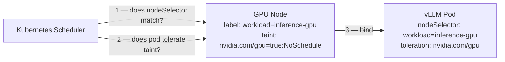
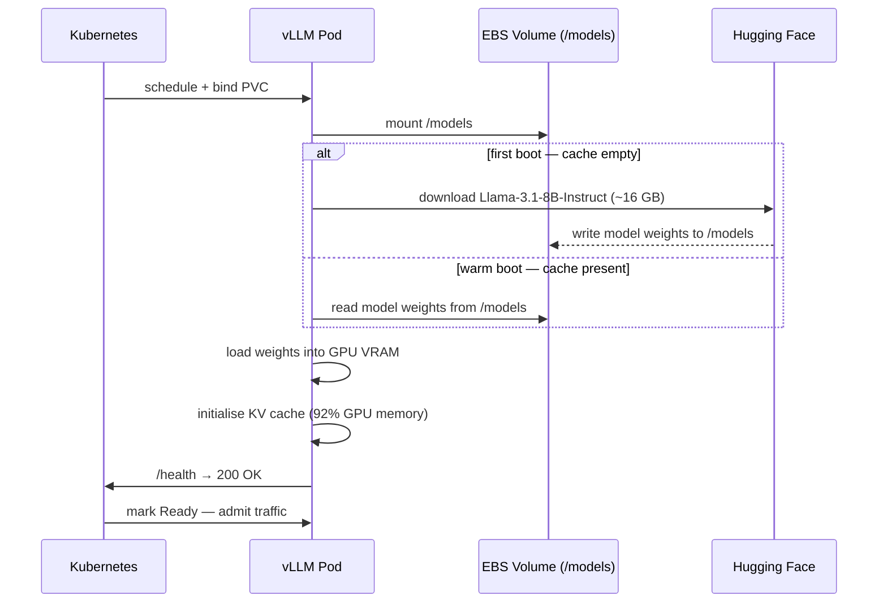
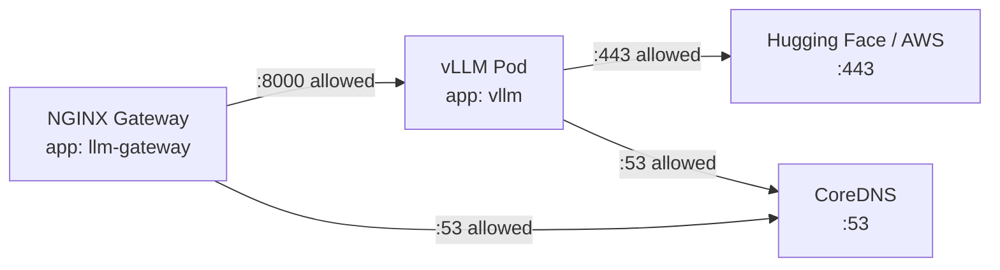

# GPU Nodes — Running Inference Pods

This document explains end-to-end how a vLLM inference pod lands on a GPU node, loads the model, and serves requests — covering scheduling, NVIDIA device exposure, storage, resource allocation, health checks, autoscaling, observability, and network isolation.

---

## How a pod reaches a GPU node

Three things in Kubernetes must align before a GPU pod can be scheduled:

### 1. The node is labelled

Terraform applies `workload=inference-gpu` to every GPU managed node group instance. This label is stable — it survives node replacement and autoscaling events.

```hcl
# infra/terraform/main.tf
gpu = {
  labels = {
    workload = "inference-gpu"
  }
  ...
}
```

### 2. The node carries a taint

GPU nodes are tainted `nvidia.com/gpu=true:NoSchedule`. This is a hard barrier: the Kubernetes scheduler will not place *any* pod on a GPU node unless that pod explicitly tolerates the taint. This prevents system pods, gateway pods, or anything else from accidentally consuming expensive GPU capacity.

```hcl
taints = {
  gpu = {
    key    = "nvidia.com/gpu"
    value  = "true"
    effect = "NO_SCHEDULE"
  }
}
```

### 3. The pod has a nodeSelector and a toleration

`deployment.yaml` declares both. The `nodeSelector` restricts the pod to labelled GPU nodes. The `toleration` lets it past the taint gate.

```yaml
nodeSelector:
  workload: inference-gpu          # must match node label

tolerations:
  - key: "nvidia.com/gpu"
    operator: "Equal"
    value: "true"
    effect: "NoSchedule"           # matches the node taint exactly
```

If either is missing, the pod stays `Pending` indefinitely.



---

## The NVIDIA device plugin

Kubernetes has no built-in knowledge of GPUs. The NVIDIA device plugin (`nvidia-device-plugin`) is a DaemonSet that runs on every GPU node. It does two things:

1. **Discovers** physical GPUs on the node via the NVIDIA Management Library (NVML).
2. **Advertises** them to the kubelet as an extended resource: `nvidia.com/gpu`.

Once the plugin is running, `kubectl describe node <gpu-node>` shows:

```
Capacity:
  nvidia.com/gpu: 1
Allocatable:
  nvidia.com/gpu: 1
```

GPU Feature Discovery (GFD, enabled via `--set gfd.enabled=true` in `install_addons.sh`) additionally labels nodes with GPU model, memory, and driver version. This allows future workloads to select specific GPU hardware if needed.

The plugin is installed with:

```bash
helm upgrade --install nvidia-device-plugin nvidia/nvidia-device-plugin \
  --namespace kube-system \
  --set gfd.enabled=true
```

---

## Resource allocation

The vLLM pod requests and limits GPU, CPU, and memory together:

```yaml
resources:
  requests:
    cpu: "4"
    memory: "32Gi"
    nvidia.com/gpu: "1"
  limits:
    cpu: "8"
    memory: "48Gi"
    nvidia.com/gpu: "1"
```

| Resource | Request | Limit | Why |
|---|---|---|---|
| `nvidia.com/gpu` | 1 | 1 | GPU is a non-compressible resource; requests must equal limits |
| `memory` | 32 Gi | 48 Gi | Model weights (~16 GB) + KV cache + overhead |
| `cpu` | 4 | 8 | Tokenisation, HTTP serving, async I/O are CPU-bound |

GPU resources behave differently from CPU and memory: they cannot be oversubscribed. If a node has 1 GPU and it is allocated, no further pod requesting `nvidia.com/gpu: 1` can be scheduled to that node. This is enforced by the device plugin, not Kubernetes core.

---

## Model cache and storage

Downloading Llama-3.1-8B-Instruct (~16 GB) on every pod start would waste minutes and egress costs. The model is stored on an encrypted EBS volume that persists across pod restarts and node replacements.

### StorageClass (`k8s/base/storageclass-gp3.yaml`)

```yaml
provisioner: ebs.csi.aws.com
reclaimPolicy: Retain         # volume survives PVC deletion
volumeBindingMode: WaitForFirstConsumer  # EBS is AZ-scoped; bind only once pod is scheduled
parameters:
  type: gp3
  encrypted: "true"
```

`WaitForFirstConsumer` is critical for EBS. EBS volumes are availability-zone-local. If the PVC bound immediately, the volume might land in a different AZ from where the GPU node lives, causing an unschedulable pod.

### PersistentVolumeClaim (`pvc.yaml`)

```yaml
accessModes:
  - ReadWriteOnce          # EBS supports a single writer; this is correct for one vLLM pod
storageClassName: gp3-retain
resources:
  requests:
    storage: 300Gi         # room for the base model + future larger models
```

The volume is mounted at `/models` inside the container. Both `HF_HOME` and `TRANSFORMERS_CACHE` point there, so Hugging Face's download cache and the model weights share the same persistent path.

---

## Pod boot sequence

On first start (empty PVC), vLLM downloads the model. On subsequent starts, it reads from the warm cache. The readiness probe gates traffic until the model is fully loaded into GPU VRAM.



The KV cache pre-allocation (`--gpu-memory-utilization 0.92`) happens at startup. vLLM reserves 92% of GPU VRAM for the KV cache upfront so it never needs to reallocate mid-inference. This is why the model is served with low latency variance but also why startup takes 1–3 minutes.

---

## vLLM startup flags

```yaml
args:
  - "--model"                  meta-llama/Llama-3.1-8B-Instruct
  - "--host"                   0.0.0.0
  - "--port"                   8000
  - "--gpu-memory-utilization" 0.92      # fraction of VRAM reserved for KV cache
  - "--max-model-len"          8192      # max context window in tokens
  - "--download-dir"           /models   # write model files here (on the PVC)
  - "--served-model-name"      meta-llama/Llama-3.1-8B-Instruct
```

`--served-model-name` controls the `model` field in the OpenAI API response. Clients that hard-code the model identifier will work without changes if you swap the underlying weights.

---

## Health probes

Loading a large model takes time. The probes are tuned to match that reality:

```yaml
readinessProbe:
  httpGet:
    path: /health
    port: 8000
  initialDelaySeconds: 20    # wait 20 s before the first check
  periodSeconds: 10
  failureThreshold: 6        # tolerate up to 60 s of startup before failing

livenessProbe:
  httpGet:
    path: /health
    port: 8000
  initialDelaySeconds: 60    # give the model time to fully load into VRAM
  periodSeconds: 15
  failureThreshold: 5        # kill and restart if unhealthy for 75 s
```

The readiness probe controls whether the pod receives traffic from the Service. Until `/health` returns 200, the pod is excluded from the endpoint list — the gateway cannot reach it. This prevents requests from hitting a pod that is still loading the model.

The liveness probe restarts the process if vLLM locks up or runs out of memory after startup.

---

## Identity and secrets

### Service account and IRSA

The pod runs as the `vllm` service account, which is annotated with an IAM role ARN:

```yaml
# serviceaccount.yaml
annotations:
  eks.amazonaws.com/role-arn: REPLACE_VLLM_IRSA_ROLE_ARN
```

At runtime, the EKS Pod Identity webhook injects a projected token into the pod. The AWS SDK inside the container exchanges this token for temporary IAM credentials scoped to the `vllm-irsa` role. The role grants:

- `cloudwatch:PutMetricData` — metrics publishing
- `s3:GetObject` / `s3:ListBucket` — optional model staging from S3 (if `vllm_model_s3_bucket_arn` is set in Terraform)

No long-lived credentials or access keys are used anywhere.

### Hugging Face token

The model on Hugging Face is gated (requires accepting the licence). The pod authenticates using a token stored in a Kubernetes Secret:

```yaml
# secret-hf-token.example.yaml
stringData:
  HF_TOKEN: "hf_xxxxxxxxxxxxxxxxxxxx"
```

The token is injected as the `HUGGING_FACE_HUB_TOKEN` environment variable via `secretKeyRef`. The Secret itself is encrypted at rest by the KMS key provisioned in Terraform.

---

## Network isolation

All pods in the `llm` namespace start from a default-deny posture:

```
networkpolicy-default-deny.yaml  →  podSelector: {}  blocks all ingress and egress
```

Two policies then open exactly the traffic that is required:

| Policy | Who it applies to | What it allows |
|---|---|---|
| `allow-gateway-ingress-and-vllm-egress` | `app: llm-gateway` | Ingress on `:8080`; egress to `app: vllm` on `:8000`; DNS |
| `allow-vllm-egress` | `app: vllm` | Egress on `:443` (Hugging Face download, CloudWatch); DNS |

The vLLM pod has **no ingress policy** beyond the gateway — it cannot be reached directly from outside the namespace. The only path in is `gateway → vllm:8000`.



---

## Autoscaling

Two controllers manage vLLM replica count, targeting 1–4 replicas (HPA) or up to 6 (KEDA):

### HPA — memory-based

```yaml
metrics:
  - type: Resource
    resource:
      name: memory
      target:
        averageUtilization: 80   # scale out when avg memory > 80% of request (32 Gi)
behavior:
  scaleDown:
    stabilizationWindowSeconds: 300   # wait 5 min before removing a replica
```

Memory is a reasonable proxy for load: each concurrent request contributes to the KV cache footprint.

### KEDA — queue-depth-based

```yaml
triggers:
  - type: prometheus
    metadata:
      query: max(vllm_request_queue_depth{namespace="llm"})
      threshold: "5"    # add a replica when queue depth exceeds 5
cooldownPeriod: 300
```

KEDA queries Prometheus every 15 seconds. When more than 5 requests are queued (waiting for a GPU batch slot), KEDA triggers a scale-out before latency degrades. This reacts faster to burst traffic than the HPA memory signal.

Each new replica needs a GPU node. The Cluster Autoscaler or Karpenter provisions one automatically when a pod sits `Pending` due to insufficient GPU capacity.

---

## Observability

### ServiceMonitor

Prometheus scrapes vLLM's built-in `/metrics` endpoint every 15 seconds via a `ServiceMonitor` in the `monitoring` namespace. Key metrics exposed by vLLM include:

| Metric | What it measures |
|---|---|
| `vllm_request_latency_seconds` | End-to-end request latency histogram |
| `vllm_request_queue_depth` | Requests waiting for a batch slot |
| `vllm_gpu_cache_usage_perc` | KV cache utilisation |
| `DCGM_FI_DEV_GPU_UTIL` | Raw GPU utilisation (from DCGM exporter) |

### Alerts

Four rules fire automatically:

| Alert | Condition | Severity |
|---|---|---|
| `LlmHighP95Latency` | p95 latency > 4 s for 10 min | warning |
| `LlmHigh5xxRate` | 5xx rate > 0.2 req/s for 5 min | critical |
| `LlmPodOOMKilled` | Any pod OOMKilled in last 10 min | critical |
| `GpuUtilizationLow` | Average GPU utilisation < 20% for 30 min | info |

The `GpuUtilizationLow` alert is an economics signal — a GPU node sitting idle at full cost is worth investigating for scale-down or scheduling problems.

---

## PodDisruptionBudget

```yaml
spec:
  minAvailable: 1
```

The PDB ensures at least one vLLM pod is available during voluntary disruptions (node drain, cluster upgrade, rolling deploy). Kubernetes will not evict the last healthy replica. Combined with `maxUnavailable: 0` in the Deployment's rolling update strategy, this means a new pod must pass its readiness probe before the old one is terminated — zero downtime even during updates.

---

## Summary: what happens when you `kubectl apply`

```
1. Namespace and StorageClass exist (k8s/base/)
2. Secret hf-token created with HF_TOKEN
3. ServiceAccount vllm applied with IRSA annotation
4. PVC vllm-model-cache provisioned → EBS volume created in correct AZ
5. Deployment applied → scheduler finds GPU node (label + taint match)
6. NVIDIA device plugin allocates 1 GPU to the pod
7. Pod mounts /models (EBS)
8. vLLM downloads model (first boot) or reads cache (warm boot)
9. vLLM loads weights into VRAM, pre-allocates KV cache
10. /health returns 200 → pod becomes Ready → Service endpoint registered
11. NGINX gateway can now proxy requests to vllm:8000
```
