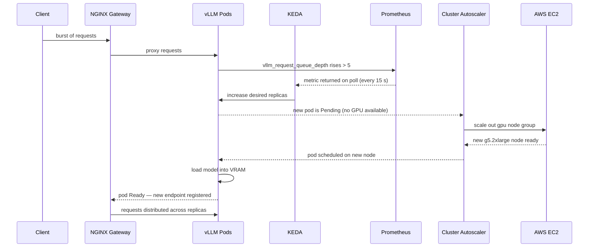
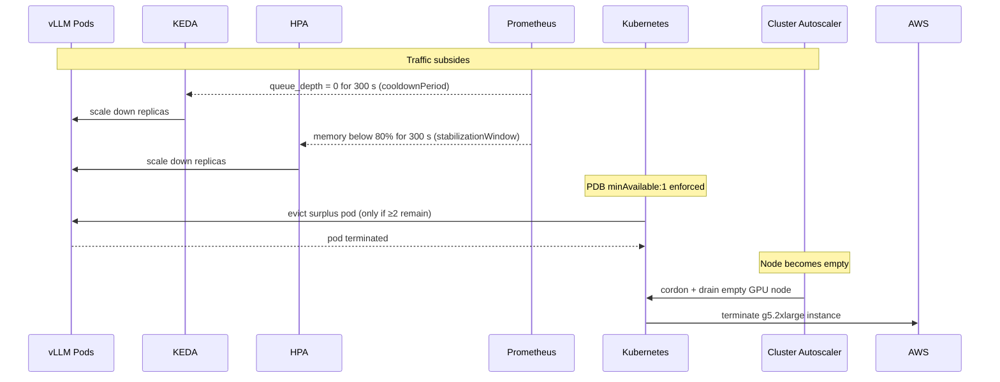

# Autoscaling

This platform uses three coordinated autoscaling layers. Pod replicas are controlled by HPA and KEDA; underlying EC2 nodes are controlled by Cluster Autoscaler or Karpenter. Each layer reacts to a different signal and operates on a different timescale.

```
Layer 1 — Pod scaling (fast, seconds):   HPA for gateway · HPA + KEDA for vLLM
Layer 2 — Node scaling (slow, minutes):  Cluster Autoscaler / Karpenter
```

---

## Layer 1a — Gateway HPA (CPU-based)

**File:** `hpa-gateway.yaml`

```yaml
scaleTargetRef:   llm-gateway Deployment
minReplicas: 2
maxReplicas: 20
metrics:
  - cpu averageUtilization: 70
```

The gateway is a stateless NGINX proxy. It is CPU-bound (TLS handling, request parsing, `envsubst` auth check). CPU is the right signal here — when connections pile up, CPU rises quickly and directly.

**How HPA computes the replica count:**

```
desiredReplicas = ceil( currentReplicas × (currentMetric / targetMetric) )
```

Example: 4 pods running at 90% average CPU against a 70% target:

```
ceil( 4 × (90 / 70) ) = ceil(5.14) = 6 replicas
```

The HPA control loop runs every 15 seconds (default). Each gateway pod requests `250m` CPU, so at `maxReplicas: 20` the gateway can absorb up to 20 × 4 = 80 CPU cores worth of sustained traffic before the ceiling is hit.

`minReplicas: 2` provides baseline redundancy across AZs. There is no `scaleDown.stabilizationWindowSeconds` set here, so the HPA uses its default 300-second stabilization window on scale-down.

---

## Layer 1b — vLLM HPA (memory-based)

**File:** `hpa-vllm.yaml`

```yaml
scaleTargetRef:   vllm Deployment
minReplicas: 1
maxReplicas: 4
behavior:
  scaleDown:
    stabilizationWindowSeconds: 300
metrics:
  - memory averageUtilization: 80
```

### Why memory, not CPU?

vLLM inference is GPU-bound, not CPU-bound. CPU utilisation on the vLLM pod stays low and flat regardless of load — it is not a useful signal. Memory is a better proxy because each concurrent request grows the KV cache in VRAM, and that pressure is visible in the container's memory usage.

`--gpu-memory-utilization 0.92` pre-allocates 92% of VRAM for the KV cache at startup, so GPU memory itself is not directly exposed as a Kubernetes resource metric. Container memory (host RAM used for model weight staging, OS buffers, and request queues) rises with load instead.

### Scale-down stabilization

```yaml
scaleDown:
  stabilizationWindowSeconds: 300
```

The HPA tracks the highest replica count seen in the last 300 seconds before deciding to scale down. This prevents rapid oscillation — if memory spikes and then drops, the platform holds the extra replica for 5 minutes before removing it. For vLLM this matters because:

- Each replica takes 1–3 minutes to warm up (model load + KV cache pre-allocation).
- Removing a replica early under a temporary lull, only to need it again 2 minutes later, causes latency spikes.

---

## Layer 1c — vLLM KEDA ScaledObject (queue-depth-based)

**File:** `scaledobject-vllm-queue.yaml`

```yaml
scaleTargetRef:   vllm Deployment
minReplicaCount: 1
maxReplicaCount: 6
pollingInterval:  15     # query Prometheus every 15 s
cooldownPeriod:   300    # wait 300 s before scaling down
triggers:
  - type: prometheus
    query: max(vllm_request_queue_depth{namespace="llm"})
    threshold: "5"
```

### What `vllm_request_queue_depth` measures

vLLM exposes this metric natively. It counts requests that have been accepted but are waiting for a GPU batch slot — they are queued because the current replicas are fully occupied processing other requests. A depth above zero means requests are waiting. A depth above the threshold means there are not enough replicas.

### Why a second scaler on top of HPA?

Memory is a **lagging** signal. By the time memory climbs, requests have already been queued for several seconds. Queue depth is a **leading** signal — it reflects backpressure the moment it starts building, before memory or latency metrics have time to react.

```
Timeline of a traffic spike:

 t=0   Requests arrive faster than vLLM can process
 t=2   Queue depth crosses threshold → KEDA fires scale-out immediately
 t=30  Memory starts climbing
 t=45  HPA would have fired (memory signal reaches threshold)
```

KEDA reacts 30–45 seconds earlier on a typical burst, which at LLM latency scales (seconds per token) is meaningful.

### KEDA's relationship to HPA

KEDA does not replace the HPA — it works alongside it by creating and managing a Kubernetes HPA under the hood. When a `ScaledObject` is applied, KEDA creates an `HPA` targeting the same deployment with an `External` metric source backed by its own metrics adapter. The `maxReplicaCount: 6` on the ScaledObject overrides the `maxReplicas: 4` on the plain HPA for the queue-depth signal, giving KEDA room to scale further under heavy queuing without conflicting.

> **Note:** Only one HPA should own a Deployment's replica count at a time to avoid a control-loop conflict. In this setup, KEDA's HPA and the manually-defined `hpa-vllm.yaml` both target the same Deployment. In production, pick one owner or combine both signals into KEDA triggers. The current configuration coexists because both HPAs aim upward — the Deployment replicas settle at the higher of the two desired counts.

---

## Scaler limits at a glance

| Scaler | Target | Signal | Min | Max | Scale-down hold |
|---|---|---|---|---|---|
| HPA `llm-gateway` | gateway Deployment | CPU 70% | 2 | 20 | 300 s (default) |
| HPA `vllm` | vLLM Deployment | Memory 80% | 1 | 4 | 300 s (explicit) |
| KEDA `vllm-queue` | vLLM Deployment | Queue depth > 5 | 1 | 6 | 300 s cooldown |

---

## Layer 2 — Node autoscaling (Cluster Autoscaler / Karpenter)

Pod autoscalers add replicas; node autoscalers add EC2 instances to run those replicas. When a pod cannot be scheduled because no node has sufficient resources, it enters `Pending` state. The node autoscaler detects this and provisions a new node.

### Node group limits (from Terraform)

| Node group | Instance | Min nodes | Max nodes |
|---|---|---|---|
| `cpu` | `m6i.xlarge` | 2 | 6 |
| `gpu` | `g5.2xlarge` | 0 | 4 |

GPU nodes can scale to zero when no inference pods are running (e.g. overnight). `min_size = 0` means no GPU nodes are kept warm — the first pod after a quiet period will wait for a node to provision (~3–5 minutes for a GPU instance) on top of the vLLM model load time (~1–3 minutes).

If cold-start latency is unacceptable, set `gpu_min_size = 1` in `terraform.tfvars` to keep one GPU node always warm.

### Why this matters for vLLM scaling

Each new vLLM replica requires one GPU. The `g5.2xlarge` has 1 NVIDIA A10G GPU, so each additional vLLM replica requires one additional EC2 instance. The scale-out chain is:

```
KEDA detects queue depth > 5
  → desired replicas increases
    → new vLLM pod is Pending (no free GPU in cluster)
      → Cluster Autoscaler / Karpenter provisions a g5.2xlarge
        → node joins cluster (~3–5 min)
          → NVIDIA device plugin advertises GPU
            → pod scheduled, model loaded (~1–3 min)
              → pod Ready, traffic routed
```

Total cold-start time for a new GPU replica: **4–8 minutes**. This is why the KEDA queue-depth trigger and HPA memory signal are both set conservatively (threshold 5, utilization 80%) — they fire early enough that the new node is ready before latency degrades past SLA.

---

## End-to-end scale-out scenario



---

## End-to-end scale-in scenario

Scale-in is deliberately slower than scale-out to protect against flapping.



The PodDisruptionBudget (`minAvailable: 1`) is enforced during node drain — the autoscaler cannot evict the last healthy vLLM pod. If only one replica is running, scale-in stops at that point.

---

## Metrics-server dependency

HPA reads CPU and memory metrics from `metrics-server`. If metrics-server is not running, all HPAs stop working — they enter an `Unable to fetch metrics` error state and freeze at their current replica count.

metrics-server is installed via:

```bash
helm upgrade --install metrics-server metrics-server/metrics-server \
  --namespace kube-system
```

KEDA has no dependency on metrics-server; it queries Prometheus directly.

---

## Tuning reference

| Parameter | Location | What to change it for |
|---|---|---|
| `averageUtilization: 70` (gateway) | `hpa-gateway.yaml` | Lower if gateway OOMs; raise if you want to run hotter |
| `averageUtilization: 80` (vLLM) | `hpa-vllm.yaml` | Lower if p95 latency degrades before scale-out triggers |
| `stabilizationWindowSeconds: 300` | `hpa-vllm.yaml` | Reduce if you can tolerate slower cold-starts; raise to be more conservative |
| `threshold: "5"` (queue) | `scaledobject-vllm-queue.yaml` | Lower for tighter latency SLA; raise to reduce GPU spend |
| `cooldownPeriod: 300` | `scaledobject-vllm-queue.yaml` | Mirror the HPA stabilization window |
| `pollingInterval: 15` | `scaledobject-vllm-queue.yaml` | Minimum is 5 s; raising reduces Prometheus query rate |
| `maxReplicas: 4` | `hpa-vllm.yaml` | Capped by `gpu_max_size = 4` in Terraform |
| `maxReplicaCount: 6` | `scaledobject-vllm-queue.yaml` | Must be ≤ `gpu_max_size` or extra pods stay Pending |
| `gpu_min_size = 0` | `terraform.tfvars` | Set to `1` to keep a warm GPU node at all times |
| `gpu_max_size = 4` | `terraform.tfvars` | Hard ceiling on concurrent vLLM replicas |
